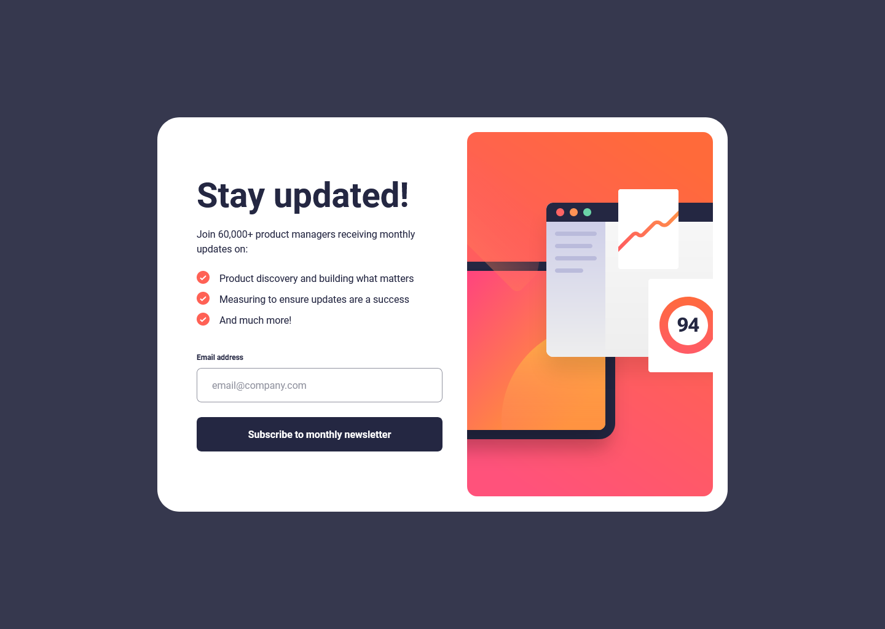

# Frontend Mentor - Newsletter sign-up form with success message

  
  

This is a solution to the [Newsletter sign-up form with success message challenge on Frontend Mentor](https://www.frontendmentor.io/challenges/pod-request-access-landing-page-eyTmdkLSG). Frontend Mentor challenges help you improve your coding skills by building realistic projects.

  

## Table of contents

  

- [Overview](#overview)

  

- [The challenge](#the-challenge)

  

- [Screenshot](#screenshot)

  

- [Links](#links)

  

- [My process](#my-process)

  

- [Built with](#built-with)

  

- [Author](#author)

  

## Overview

  

### The challenge

  

Users should be able to:

  

- View the optimal layout for the interface depending on their device's screen size

  

- See hover and focus states for all interactive elements on the page

  

### Screenshot

  

  

### Links

  

- [Solution](https://github.com/beqarion/fm-jr-js-signup-form-with-success-message)

  

- [Live Site](https://newsletter-signup-form-success.netlify.app/)

  

## My process

  

### Built with

  

- Semantic HTML5 markup

  

- Vanilla JS

  

- CSS custom properties

  
- Tailwind CSS
  

- Mobile-first workflow

  

## Author

  

- Frontend Mentor - [@beqarion](https://www.frontendmentor.io/profile/beqarion)